# VICORE - Diagrammes d'Architecture Mermaid

## 1. Architecture Globale du Système

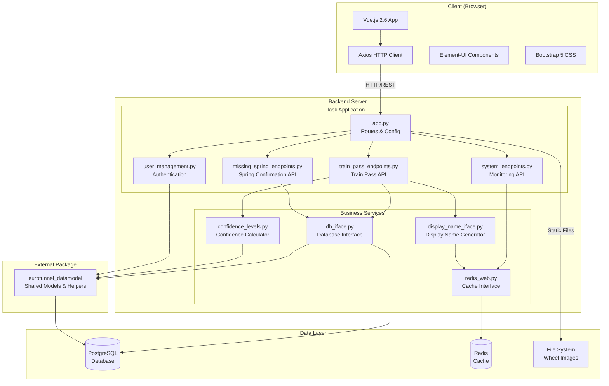

## 2. Architecture des Composants Backend

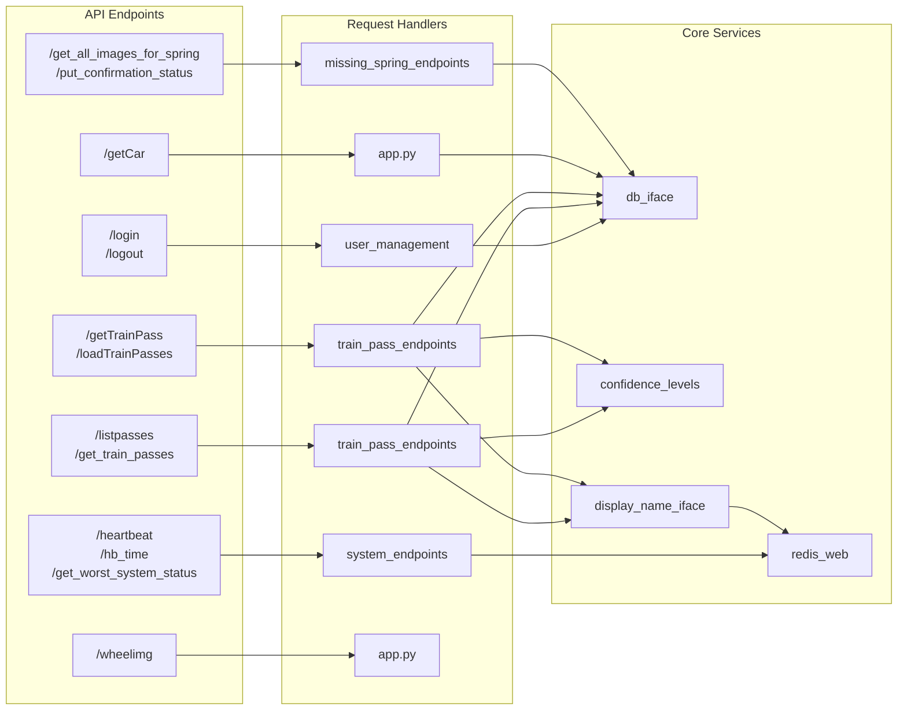

## 3. Modèle de Données (Entity Relationship)

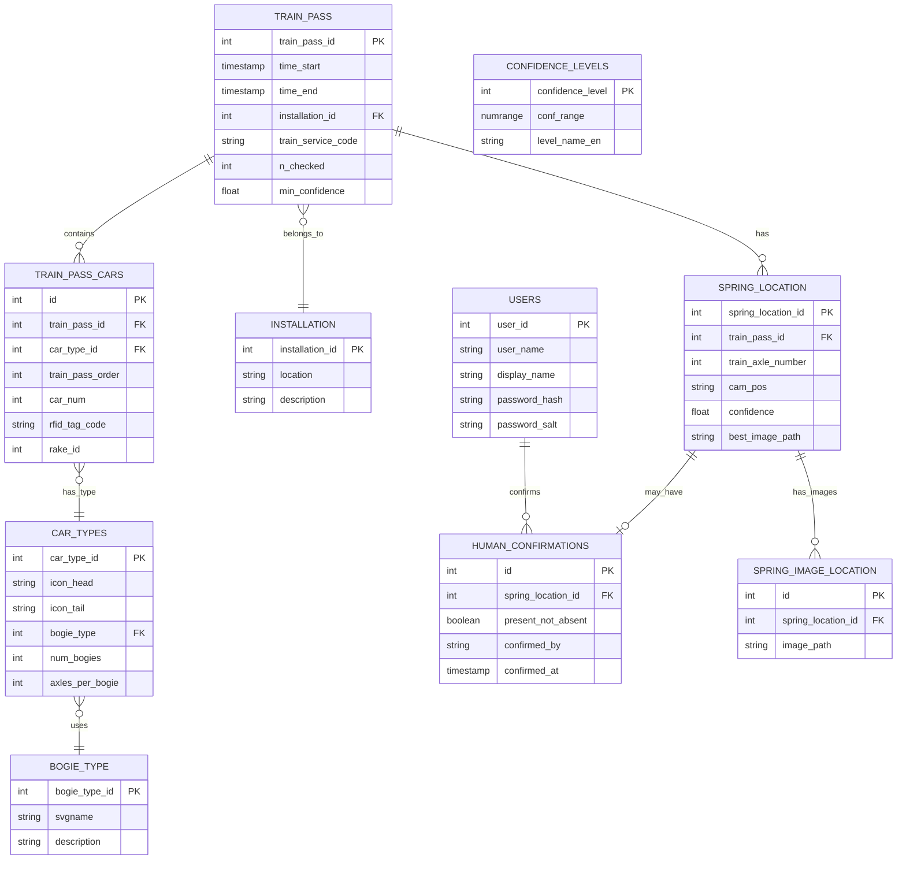

## 4. Flux d'Authentification

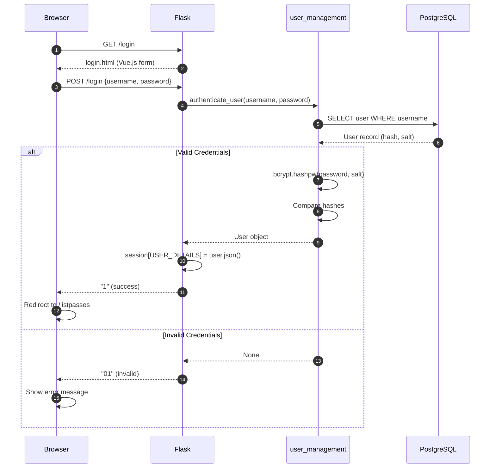

## 5. Flux de Visualisation des Passages

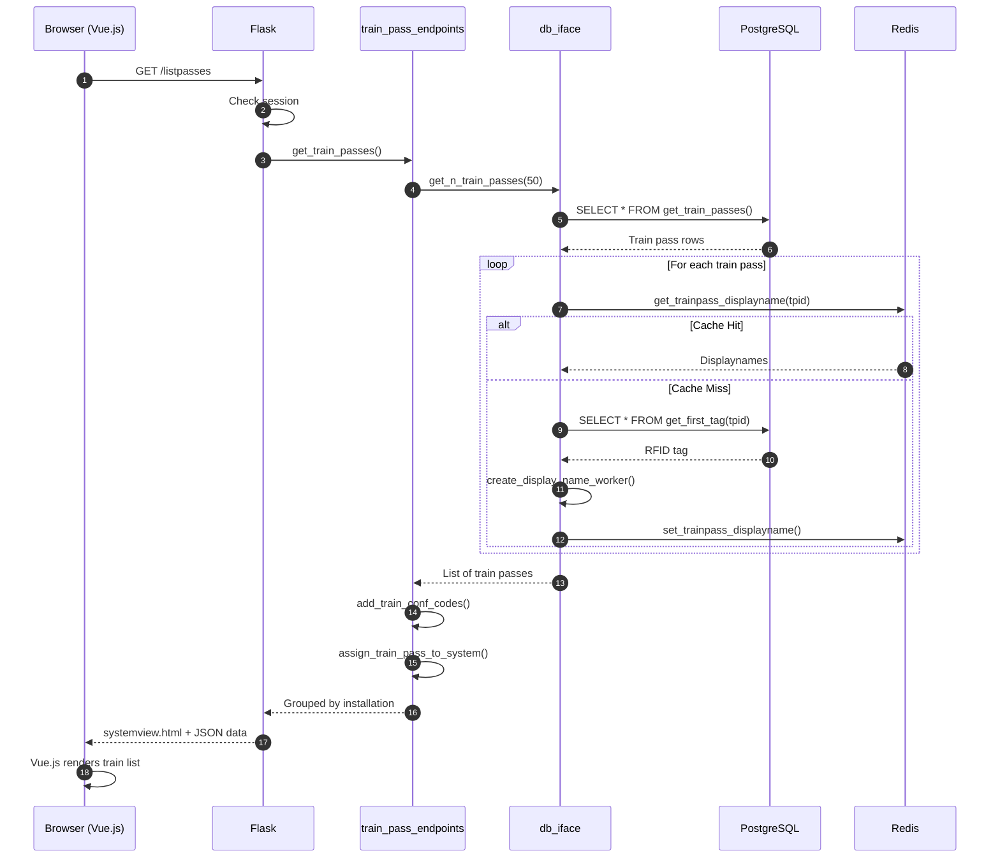

## 6. Flux de Confirmation de Ressort

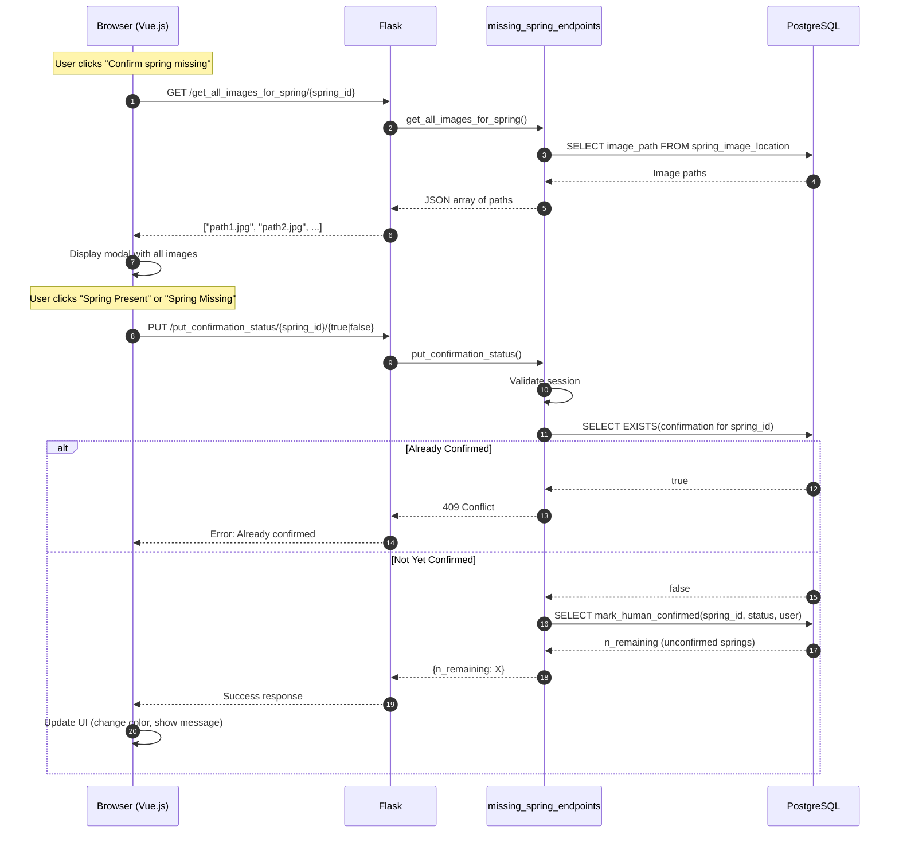

## 7. Architecture Frontend (Vue.js)

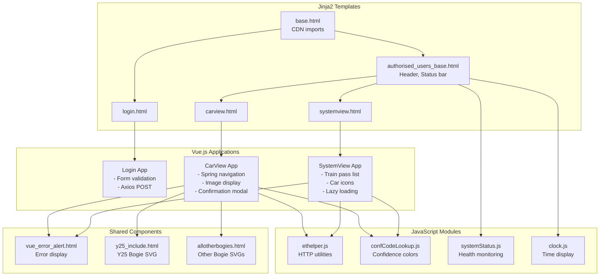

## 8. Déploiement Docker

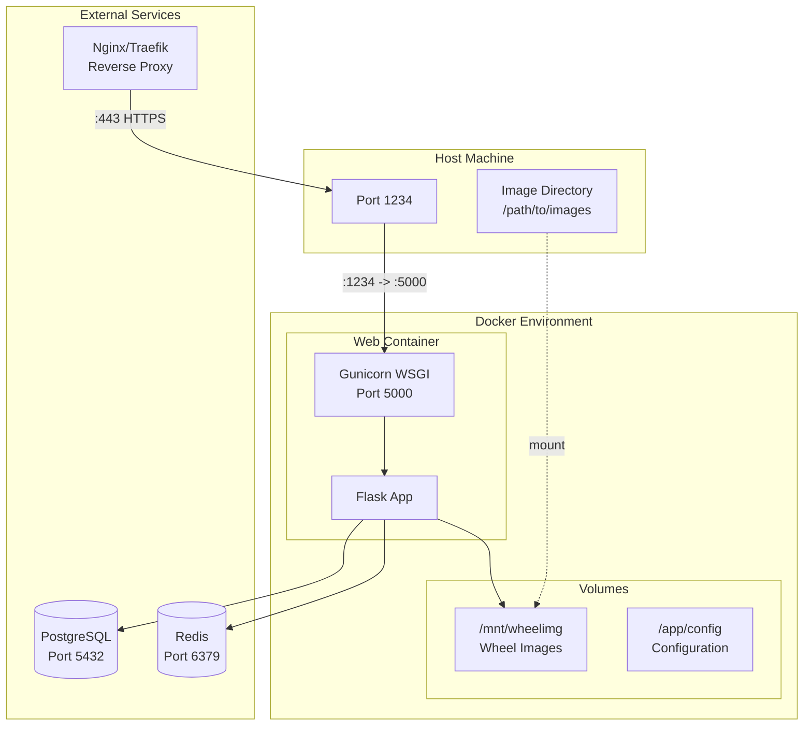

## 9. Niveaux de Confiance - Machine d'État

```mermaid
stateDiagram-v2
    [*] --> Unchecked: Train passes inspection

    Unchecked --> GREEN: confidence >= threshold_green
    Unchecked --> AMBER: threshold_amber <= confidence < threshold_green
    Unchecked --> RED: confidence < threshold_amber

    GREEN --> Confirmed_Present: Human confirms
    AMBER --> Confirmed_Present: Human confirms present
    AMBER --> Confirmed_Missing: Human confirms missing
    RED --> Confirmed_Present: Human confirms present
    RED --> Confirmed_Missing: Human confirms missing

    state GREEN {
        [*] --> conf_code_1
        note right of conf_code_1: Color: Green
    }

    state AMBER {
        [*] --> conf_code_2
        note right of conf_code_2: Color: Orange
    }

    state RED {
        [*] --> conf_code_3
        note right of conf_code_3: Color: Red
    }

    state Confirmed_Present {
        [*] --> conf_code_0
        note right of conf_code_0: Color: Blue
    }

    state Confirmed_Missing {
        [*] --> stays_red
        note right of stays_red: Requires attention
    }
```

## 10. Flux de Données Complet

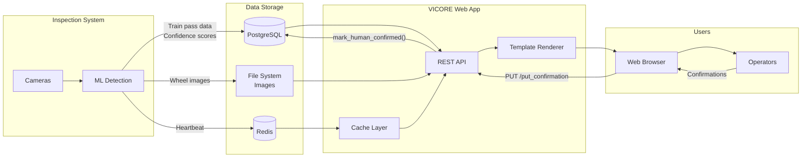

## 11. Structure des Sessions

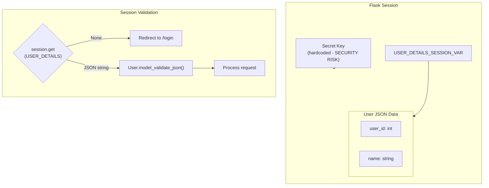

## 12. API Routes Map

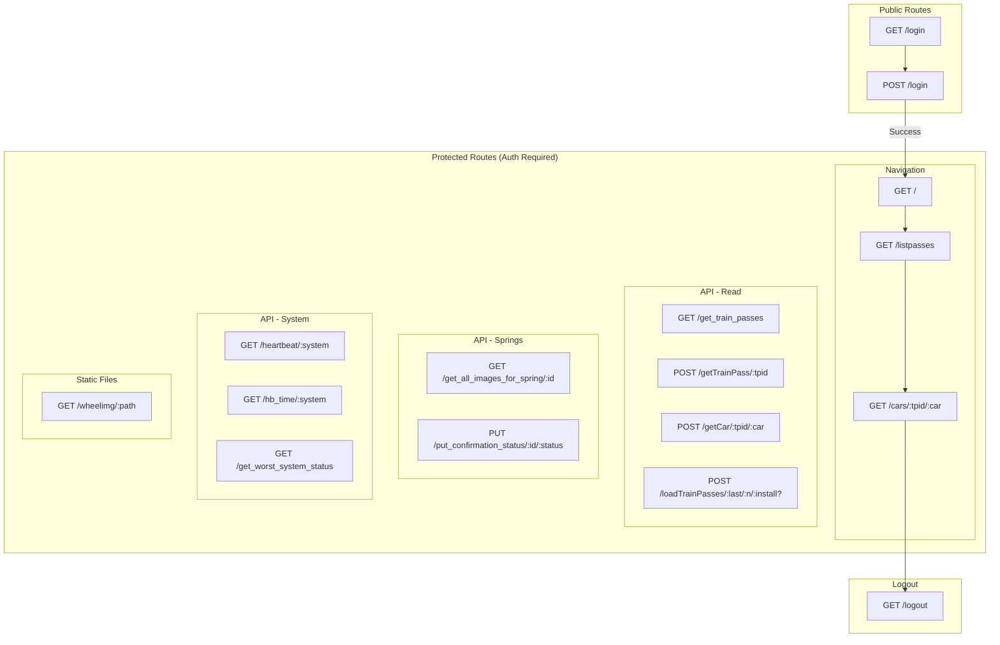

---

## Notes d'Utilisation

Ces diagrammes peuvent être visualisés avec:
- **GitHub**: Rendu natif dans les fichiers Markdown
- **GitLab**: Rendu natif dans les fichiers Markdown
- **VS Code**: Extension "Markdown Preview Mermaid Support"
- **Mermaid Live Editor**: https://mermaid.live

Pour intégrer dans une documentation:
```html
<script src="https://cdn.jsdelivr.net/npm/mermaid/dist/mermaid.min.js"></script>
<script>mermaid.initialize({startOnLoad:true});</script>
```

---

*Diagrammes générés le 2026-01-16*
*Version: 1.0.0.12*
